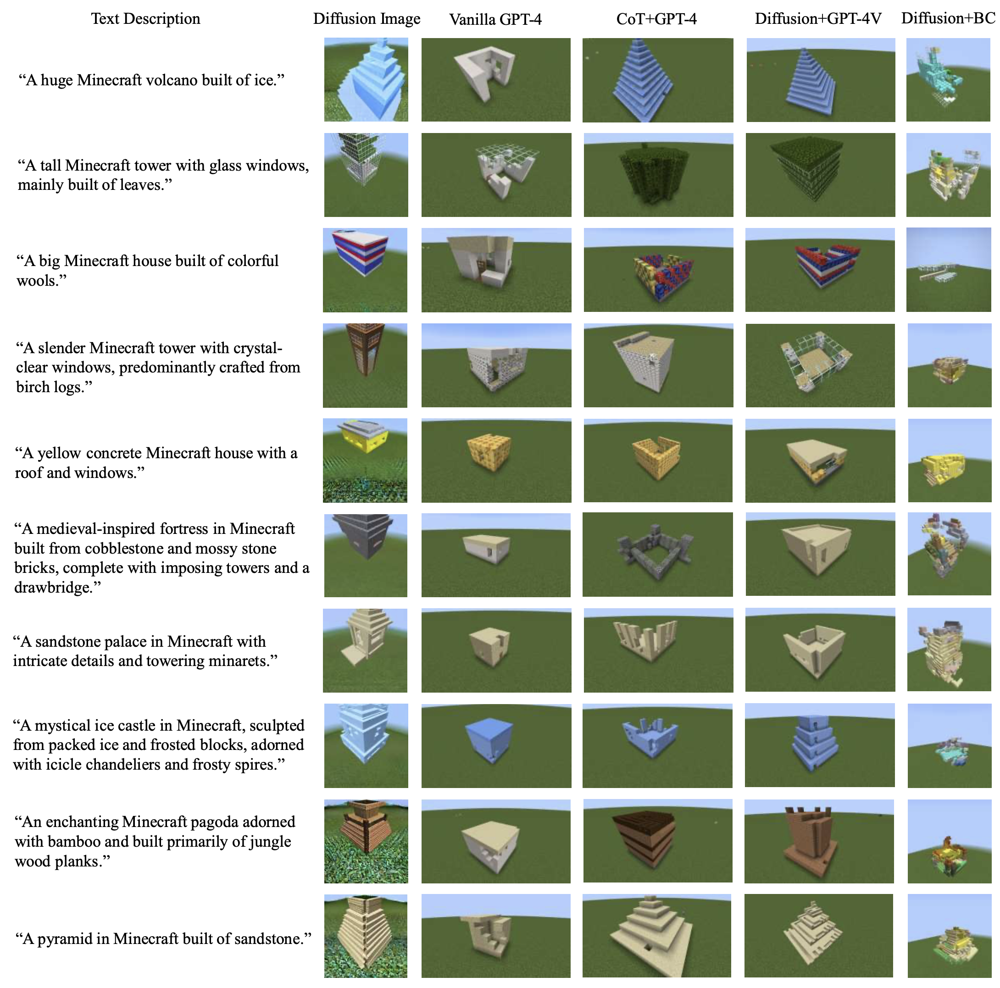

# Creative Agents: Empowering Agents with Imagination for Creative Tasks

<div align="center">

[[Website]](https://sites.google.com/view/creative-agents) 
[[arXiv]](https://arxiv.org/abs/2312.02519)

</div>

We propose **Creative Agents**, the first framework that can handle creative tasks in an open-ended world. Using this framework, we implement various embodied agents through different combinations of imaginators and controllers. **Creative Agents** is an initial attempt in this field, aimed at raising the awareness of building intelligent agents with creativity.


## Installation

Our models and dataset have been released. You can find them at:
- [https://doi.org/10.5281/zenodo.10277346](https://doi.org/10.5281/zenodo.10277346) (models)
- [https://doi.org/10.5281/zenodo.10275049](https://doi.org/10.5281/zenodo.10275049) (dataset)

### Basic Requirements

MineDojo works with ```Ubuntu>=18.04```, ```Python>=3.9``` and ```Java jdk 1.8.0_171```, while Voyager works with both ```Ubuntu>=20.04``` and ```Windows```, with ```Java 17``` installed. On ```Windows 10```, installing a virtual environment with ```Python>=3.10``` is recommended.

### Install Packages and Environments

#### Install MineDojo
You can download the MineDojo environment for Creative Agents Here: [Modified MineDojo Environment](https://zenodo.org/records/10321659)

#### Install Voyager
Please follow [Voyager Install Tutorial](https://github.com/MineDojo/Voyager). Note that you should accomplish all the four parts:
- [Python Install](https://github.com/MineDojo/Voyager#python-install)
- [Node.js Install](https://github.com/MineDojo/Voyager#nodejs-install)
- [Minecraft Instance Install](https://github.com/MineDojo/Voyager#minecraft-instance-install)
- [Fabric Mods Install](https://github.com/MineDojo/Voyager#fabric-mods-install)


#### Install Dependencies for BC Controller

```bash
pip install -r ./BC_Controller/requirements.txt
```

### Get Started

```
git clone https://github.com/PKU-RL/Creative-Agents
```

Before running with CoT+GPT-4 or Diffusion+GPT-4V, please make sure you have an OpenAI API Key that can access to GPT-4 and GPT-4V(ision).
In our experiments, we use Minecraft Official Launcher instead of Microsoft Azure, following this [link](https://github.com/MineDojo/Voyager/blob/main/installation/minecraft_instance_install.md#option-2-minecraft-official-launcher).

To test with CoT+GPT-4, run:
```
python cot_gpt4.py --api_key <API_KEY> --task <TASK_DESCRIPTION> --mc_port <LAN_PORT>
```

To test with Diffusion+GPT-4V, run:
```
python diffusion_gpt4.py --api_key <API_KEY> --image_path <IMAGE_PATH> --mc_port <LAN_PORT>
```

To test with Diffusion+BC, run:

```
python ./BC_Controller/BC_pipline.py
```


Diffusion+BC results(images, voxels, voxel sequence and building result) will be saved in ```./BC_Controller/results```.


To type your prompts for building, modify ```./BC_Controller/results/validation_prompt.txt```.

To train image generation part in Diffusion+BC, run:
```
python ./BC_Controller/txt2img/train_text_to_image_lora.py
```

To train voxel generation part in Diffusion+BC, run:
```
python ./BC_Controller/img2vox/runner.py
```

To train sequence part in Diffusion+BC, run:
```
python ./BC_Controller/vox2seq/train.py
```


## Showcases and Demonstrations




|(Diffusion+GPT-4V) A screenshot of a white pyramid-like house in Minecraft with windows, which is built of snow | (Diffusion+GPT-4V) A sandstone palace in Minecraft with intricate details and towering minarets |
|:-------------------------------------------------------------------------------------:|:------------------------------------------------------------------------------------------------:|
|                                    |                                               |
|       **(CoT+GPT-4) Build a wooden house made of oak_planks and glass**               |               **(CoT+GPT-4) Build a modern house with quartz_blocks and glass**                  |
|                                  |                                               |


## Citation
If you find our benchmark meaningful and useful, please consider citing us!
```bibtex
@article{zhang2023creative,
      title={Creative Agents: Empowering Agents with Imagination for Creative Tasks},
      author={Zhang, Chi and Cai, Penglin and Fu, Yuhui and Yuan, Haoqi and Lu, Zongqing},
      journal={arXiv preprint arXiv:2312.02519},
      year={2023}
}
```
