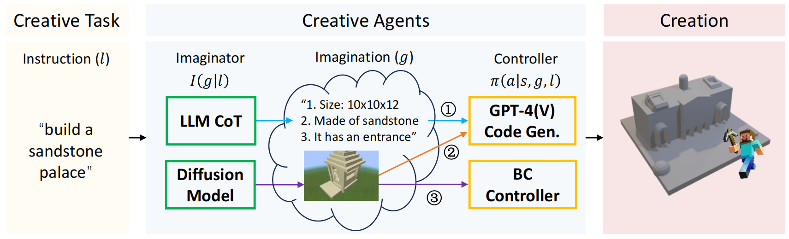

# Creative Agents: Empowering Agents with Imagination for Creative Tasks


We propose **Creative Agents**, the first framework that can handle creative tasks in an open-ended world. Using this framework, we implement various embodied agents through different combinations of imaginators and controllers. **Creative Agents** is an initial attempt in this field, aimed at raising the awareness of building intelligent agents with creativity.



## Installation

### Install Packages and Environments

#### Install MineDojo
You can install the MineDojo environment following the [official document](https://docs.minedojo.org/sections/getting_started/install.html#prerequisites). 

#### Install Voyager
Please follow [Voyager Install Tutorial](https://github.com/MineDojo/Voyager). Note that you should accomplish all the four parts:
- [Python Install](https://github.com/MineDojo/Voyager#python-install)
- [Node.js Install](https://github.com/MineDojo/Voyager#nodejs-install)
- [Minecraft Instance Install](https://github.com/MineDojo/Voyager#minecraft-instance-install)
- [Fabric Mods Install](https://github.com/MineDojo/Voyager#fabric-mods-install)


#### Install Dependencies for BC Controller

</font> <font color=Red> TODO: Install Dependencies for BC Controller </font> <font color=Black>

### Get Started

```
git clone https://github.com/PKU-RL/Creative-Agents
```

Before running with CoT+GPT-4 or Diffusion+GPT-4V, please make sure you have an OpenAI API Key that can access to GPT-4 and GPT-4V(ision).
To test with CoT+GPT-4, run:
```
python cot_gpt4.py --api_key <API_KEY> --task <TASK_DESCRIPTION> --mc_port <LAN_PORT>
```

To test with Diffusion+GPT-4V, run:
```
python diffusion_gpt4.py --api_key <API_KEY> --image_path <IMAGE_PATH> --mc_port <LAN_PORT>
```

To test with Diffusion+BC, run:
</font> <font color=Red> TODO: how to run Diffusion+BC </font> <font color=Black>

## Showcases and Demonstrations


| Build according to a desert-style house with sandstones | Build according to a fantastic house with iron_block, gold_block, and glass |
|:-------------------------------------------------------:|:---------------------------------------------------------------------------:|
|      |                          |
|       **Build a wooden house made of oak_planks**       |      **Build a modern house with quartz_blocks and polished_andesite**      |
|      |                          |


## Citation
If you find our benchmark meaningful and useful, please consider citing us!
```bibtex
@article{
}
```
